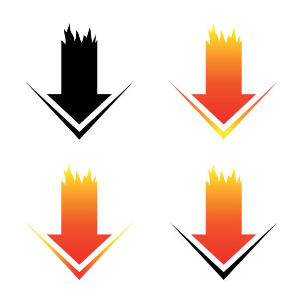

# HPE Model Downloader

[](FireDownload.jpg)

**Model Downloader** is a web UI + FastAPI service (Helm chart `model-downloader` v1.4.4, images `ghcr.io/ai-solution-eng/model-downloader` and `ghcr.io/ai-solution-eng/hf-downloader`) that submits HuggingFace model-download Jobs onto a Kubernetes cluster's shared model storage. Users pick a model and a target namespace in the browser; the service creates a per-submission HF-token Secret plus a downloader Job (PVC- or S3-backed) and tracks it to completion. Downloaded models are listed from the shared `models-pvc` and/or S3, and model configurations can be pushed from a curated catalog straight into the MLIS/AIOLI database. It is built for **HPE Private Cloud AI (PCAI / HPE Ezmeral Unified Analytics)**, where models land on the shared `models-pvc` every `project-user-*` namespace mounts, and/or an S3-compatible bucket such as MinIO.

## What problem(s) it solves

- **Pulling HF models into air-gapped / proxied PCAI clusters.** Downloader Jobs and the app pod get the HPE corporate proxy (`hpeproxy.its.hpecorp.net:8080`) and `no_proxy` environment via `hpe_proxies`, together with the httpx TLS-verification bypass needed to get through the Zscaler MITM proxy, which presents an untrusted certificate. Outbound GitHub fetches (catalog refresh) follow the same rule.
- **A shared `models-pvc` workflow without cluster access for end users.** End users never touch `kubectl`: they submit a download from the UI, the Job runs in their `project-user-*` namespace, writes the HF cache on the PVC every project namespace already mounts, and shows the resulting `pvc://models-pvc/large-models/<model>?containerPath=/mnt/models` URL in the Jobs table.
- **Model catalog management + push to MLIS.** A GPU-tier-grouped catalog (seeded from a bundled JSON, refreshable from GitHub, extendable in the UI or by pasting JSON) can push model configurations straight into the AIOLI/MLIS `packaged_models` table — the step that makes models appear in MLIS model serving.
- **Debug pods for cache inspection.** A one-click long-running debug shell mounts the same PVC at `/mnt`, so you can inspect/repair the model cache with `huggingface-cli` instead of submitting probe downloads. It is deliberately created as a Job so platform Kyverno admission admits it (see [Kyverno on hosted trial systems](#kyverno-on-hosted-trial-systems--read-before-deploying)).
- **S3 / MinIO downloads.** When the deployment has an S3-compatible backend, model files stream straight into `s3://<bucket>/<prefix>/<org>/<Model>/` with per-file parallelism — no PVC required — and the "Downloaded models" list scans both backends.

## Features

All of the following are implemented in `src/model_downloader/` and wired by `helm/` (v1.4.x):

- **Web UI** (FastAPI + Jinja2 + static JS, dark/light theme): submit downloads, a live Jobs table with logs/progress/error columns and delete for finished jobs, a "Downloaded models" table, and a debug-pod section.
- **PVC downloads**: the Job runs `huggingface_hub.snapshot_download` with 8-way per-file parallelism (`max_workers=8`) into `HUGGINGFACE_HUB_CACHE` on the shared PVC mounted at `/mnt`. Default cache root is `/mnt/large-models/<model>`; an explicit custom absolute path is accepted and validated (no `..`). Retries (`downloader.backoffLimit`) resume the partial HF cache instead of restarting, because blobs and `.incomplete` files live on the PVC.
- **S3 downloads**: the Job lists repo files and uploads each one to S3 with a thread pool of 8 concurrent files; each upload itself uses S3 multipart (64 MB threshold, 8-way concurrency). Scratch space is an `emptyDir` sized by `downloader.s3WorkSize` (or `downloader.s3WorkPvcName` when set), so only in-flight files are held locally.
- **Queue with bounded concurrency**: at most `maxConcurrency` model downloads run at once; extra submissions queue in-process. On startup the queue reconciles previously created Jobs from Kubernetes, so downloads submitted before an app restart reappear in the UI.
- **Per-submission HF-token Secrets**: each submission creates `hf-token-<model>-<suffix>` in the target namespace, referenced only by that Job, and is deleted as soon as the Job finishes (or if Job creation is denied).
- **"Downloaded models" list**: merges three sources — succeeded job history, a live boto3 S3 listing, and a short-lived PVC scanner Job (`md-scan-*`, finds `models--<org>--<repo>` cache dirs) — deduplicated by model name, most recent first. The PVC is scanned on demand via **Rescan storage**, or automatically every `downloadList.pvcRefreshInterval` seconds when `downloadList.pvcScanEnabled: true`.
- **Namespace dropdown search** on the submit form, backed by `/api/namespaces` and filtered to `project-user-*` (an RBAC denial degrades to typing a namespace manually).
- **Debug pods** (chart ≥ 1.2): UI-launched long-running shell Jobs (`md-debug-*`) mounting the same PVC at `/mnt` with `HUGGINGFACE_HUB_CACHE` preset; optional HF token; the UI prints the ready-made `kubectl exec` command and deleting a debug job from the UI also deletes its token Secret.
- **Model catalog** (`/catalog`): entries grouped by GPU tier — H200 (FP8 · 141 GB), RTX Pro 6000 (FP8/NVFP4 · 96 GB), L40S (FP8 · 48 GB). Seeded on start from the bundled `seed_catalog.json` without overwriting user edits or resurrecting removed entries; **Refresh from GitHub** pulls the upstream seed JSON from `catalog.githubUrl` (button hidden when unset); the direct-JSON box accepts a single object **or** an array for **Push to MLIS** or **Add to Catalog** (duplicates by `catalog_id` or `name`+`version` are skipped).
- **Chat templates**: pick a preset from the catalog or supply path + contents; the downloader Job writes the file into the model cache during the download.
- **PCAI integration**: Istio VirtualService on `istio-system/ezaf-gateway` at `model-downloader.${DOMAIN_NAME}`, an oauth2-proxy `AuthorizationPolicy` in `istio-system`, a pre-install Kyverno ClusterPolicy stamping EZUA vendor labels (see below), and RBAC for cross-namespace Job/Secret creation, pod-log reads and namespace listing.

## Deploying on PCAI

PCAI users **never** run `helm install` or `kubectl apply`. The chart is imported into PCAI once (the packaged chart, e.g. `model-downloader-1.4.4.tar.gz`), and from then on deployments are just values: edit the chart's `values.yaml` in the PCAI **Helm Values** editor (or via the PCAI API) and apply. PCAI resolves `${DOMAIN_NAME}` itself before rendering, so leave those placeholders as-is.

**Before you start** (cluster-side prerequisites, not chart values):

- The target `project-user-*` namespaces have the shared `models-pvc` (PCAI provides this).
- For S3: the bucket exists (`s3.bucket` — the chart does not create it) and you have its access/secret keys.
- For MLIS push: the AIOLI database service is reachable and its password Secret (`aioli.dbPasswordSecret`, default `aioli-db-password` in namespace `mlis`) exists.
- For PCAI ingress: the platform gateway `istio-system/ezaf-gateway` and the `oauth2-proxy` auth provider exist.

**Required values** (the ones every deployment must set or confirm):

| Value | Why |
|---|---|
| `defaultNamespace` | Namespace pre-filled in the download form; must be a `project-user-*` namespace that owns a `models-pvc`. |
| `storage.backend` + `storage.default` | `pvc`, `s3`, or `both`; `default` is the preselected option in the submit form. With `backend: pvc` the app gets no S3 configuration at all. |
| `s3.endpointUrl`, `s3.bucket`, `s3.accessKeyId`, `s3.secretAccessKey` | Required when the backend includes `s3` (e.g. MinIO at `http://minio.minio.svc.cluster.local:9000`, bucket `mlis-models`). `s3.prefix` is optional. |
| `aioli.*` (`dbHost`, `dbPort`, `dbName`, `dbUser`, `dbPasswordSecret`) | MLIS/AIOLI database connection used by the catalog **Push to MLIS** endpoints. |
| Image tags | Packaged with the chart — `image.tag` v1.4.4 (matches the chart version), `downloader.image` `ghcr.io/ai-solution-eng/hf-downloader:v1.0`, `debugPod.image` / `downloadList.scanImage` `andrewbydlon/basic-ubuntu-essentials:v1.0`. Leave defaults unless you build your own images. |

**Optional values** (defaults are sane; see [helm/values.yaml](helm/values.yaml) comments):

- `maxConcurrency` — max parallel model downloads (default 4).
- `downloader.*` — Job resources, `backoffLimit`, `nodeSelector`, `ttlSecondsAfterFinished`, `hf.*` timeouts (`downloadTimeout`, `etagTimeout`, `enableHfTransfer`, `disableXet`, `verifyTls`), `disableSecurityContext`/`securityContext`, S3 scratch (`s3WorkPvcName`, `s3WorkSize`, `s3WorkPath`).
- `downloadList.*` — `enabled`, `pvcScanEnabled`, `pvcRefreshInterval`, `scanImage`.
- `debugPod.*` — `enabled`, `image`, `pvcName` (override), `user`, `cachePath`, `ttlSecondsAfterFinished`.
- `hpe_proxies` + `pcai.httpsProxy` / `pcai.noProxy` — proxy env on downloader Jobs and the app pod, plus the Zscaler TLS bypass. `true` only behind the HPE corporate proxy.
- `catalog.*` — `enabled`, `size`, `storageClassName`, `githubUrl` (enables **Refresh from GitHub**), `githubVerifyTls`.
- `kyverno.enabled` — keep `true` on any PCAI cluster (see next section).
- `ezua.*` — `domainName`, `virtualService.endpoint` / `.istioGateway` / `.timeout`, `authorizationPolicy.namespace` / `.providerName`.
- Rarely needed: `service.*`, `resources`, `nameOverride`/`fullnameOverride`.

## Kyverno on hosted trial systems — read before deploying

This is the section that decides whether downloads run at all on a hosted trial. Everything below is taken from this repository's own code and comments.

### What the platform policy does

HPE PCAI ships a **cluster-wide Kyverno policy named `protect-models-pvc`** that **denies any pod mounting the shared `models-pvc` unless it carries the MLIS authorization label `hpe-ezua/app: mlis`**. A pod created directly — by a user or by this app's ServiceAccount — is not allowed to set that label, so creation is rejected. The repo documents the denial rule and message verbatim:

> denied by the platformwide protect-models-pvc Kyverno policy
> (prevent-unauthorized-create-with-mlis: "Insufficient authorization to set
> the 'hpe-ezua/app' label to 'mlis'")

— `helm/templates/configmap-job-template.yaml` lines 325–332 (comment on the `debug-job.yaml` template; same wording in `helm/values.yaml` lines 160–165).

### How this chart's Jobs get admitted

- **Downloader Jobs carry the label.** Both Job templates (`job.yaml` for PVC, `job-s3.yaml` for S3) set `hpe-ezua/app: mlis` on the pod template (`helm/templates/configmap-job-template.yaml` lines 26 and 171), alongside the `hpe-ezua/disable-sc` security-context opt-out annotation that lets them run as root and mount the root-owned shared PVC.
- **The UI debug pod is a Job on purpose.** A bare Pod created by the app's ServiceAccount would be denied by `protect-models-pvc` for setting `hpe-ezua/app: mlis`. The debug pod is therefore created as a Job (`debug-job.yaml`, label at line 359): its Pod is then created by the **kube-system job-controller**, i.e. the exact same admission path as the downloader Jobs, and pods with these labels are admitted (`helm/values.yaml` lines 160–165, `src/model_downloader/app/k8s.py` lines 249–254, UI text in `src/model_downloader/app/templates/index.html` lines 163–169).
- **The PVC scanner Job carries the same label** (`scan-job.yaml`, line 434), so "Rescan storage" works under the same policy.

### The chart's own Kyverno policy

Separate from the platform policy, the chart installs a **pre-install ClusterPolicy named `add-vendor-app-labels-<release>-<chart>`** (`helm/templates/kyverno-policy.yaml`, rule `add-vendor-app-labels`), gated by `kyverno.enabled` (default `true`). It stamps `hpe-ezua/type: app-service-core` and `hpe-ezua/app: model-downloader` onto Deployments and Services **in the release namespace** so EZUA/PCAI ingress discovery picks the app up. It does not touch the downloader Jobs (those live in `project-user-*` namespaces and rely on the platform policy described above).

### What must hold on a hosted trial

On **SE G2** this all works out of the box. On a **hosted trial** the *customer's* platform policies are the gate, and the following must hold before downloads will run:

1. **The platform `protect-models-pvc` policy admits the labeled Jobs.** The chart's Jobs run in `project-user-*` namespaces and present `hpe-ezua/app: mlis` — the exact label the policy wants. If the customer's installed policy is stricter than the stock one (e.g. it also restricts *who* may set the label, or it does not exempt job-controller-created pods), the customer admin must apply the platform policy patch/exception for the namespaces this release writes to. Confirm with the customer's PCAI admin before assuming a denial is an app bug. The concrete patch is in [the next subsection](#the-platform-policy-patch-customer-admin).
2. **`kyverno.enabled` stays `true`.** Disabling it stops the pre-install `add-vendor-app-labels-<release>-<chart>` ClusterPolicy from stamping the vendor labels, and the Deployment/Service can disappear from EZUA's app discovery.
3. **`debugPod.enabled` / downloader behavior is unchanged** — the debug pod's Job-based admission path is the documented workaround; do not "fix" a denial by switching it to a bare Pod, that will always be denied.

### The platform-policy patch (customer admin)

The concrete patch for the hosted-trial case where the installed `protect-models-pvc` policy denies job-controller-created pods: it appends a `NotEquals` condition to the deny conditions of `rules[1]`, exempting the kube-system job-controller — which creates the Pods for every Job this chart submits (downloader, debug, and scanner alike) — while leaving the original conditions in force for every other creator:

```bash
kubectl patch clusterpolicy protect-models-pvc --type json -p='[
  {"op": "add", "path": "/spec/rules/1/validate/deny/conditions/all/-",
   "value": {"key": "{{request.userInfo.username}}", "operator": "NotEquals", "value": "system:serviceaccount:kube-system:job-controller"}}
]'
```

After applying, Job pods created by the job-controller are no longer denied and the Jobs can mount `models-pvc`; the admission webhook may take a few seconds to pick up the updated policy. This mutates a customer-owned, cluster-wide platform policy — apply it only with the customer's PCAI admin, and only if their installed policy does not already carry the exception.

### What a denial looks like

Admission failures surface as Kubernetes API errors, passed through verbatim:

- **Debug pod launch**: the API handler maps the `ApiException` to `k8s API returned <status>: <apiserver message>` (`src/model_downloader/app/main.py` `_api_error_detail`, lines 423–442) and the UI shows it in the message box. For this policy you would see, e.g., `k8s API returned 400: ... prevent-unauthorized-create-with-mlis: Insufficient authorization to set the 'hpe-ezua/app' label to 'mlis'`. On failure the app cleans up the token Secret it had created (`src/model_downloader/app/k8s.py` lines 282–290).
- **Download submission**: the queue records the raw exception (including the apiserver denial body) in the job's **Error** column of the Jobs table (`src/model_downloader/app/queue.py` lines 166–168).
- An RBAC denial (403) surfaces the same way, e.g. on `/api/namespaces`.

If you see either message on a hosted trial, it is the customer's platform policy — take it to the admin with the rule names above, not to the chart.

## Deployment targets

### SE G2

The internal HPE "G2" PCAI cluster (`pcai-se-ai-application.hst.rdlabs.hpecorp.net`):

- `hpe_proxies: true` — downloader Jobs and the app pod go through `hpeproxy.its.hpecorp.net:8080` with the internal `no_proxy` list; TLS verification is bypassed because the Zscaler MITM cert is untrusted (also applies to the catalog's GitHub fetch).
- Storage: both backends — the shared `models-pvc` (default) and MinIO at `http://minio.minio.svc.cluster.local:9000`, bucket `mlis-models`, prefix `large-models`.
- `defaultNamespace: project-user-<USERNAME>`; Kyverno works out of the box.
- Sanitized example: [helm/values-examples/values.g2.yaml](helm/values-examples/values.g2.yaml).

### Hosted trial

A customer-hosted PCAI system:

- Everything ingress-related uses `${DOMAIN_NAME}` placeholders (`ezua.domainName`, `ezua.virtualService.endpoint` = `model-downloader.${DOMAIN_NAME}`) — PCAI substitutes the real domain before rendering. The UI is then served at `https://model-downloader.<customer-domain>` behind oauth2-proxy SSO.
- `hpe_proxies: false` unless the cluster egresses via the HPE corporate proxy.
- The Kyverno requirements in [the section above](#kyverno-on-hosted-trial-systems--read-before-deploying) are the main risk: the customer's platform `protect-models-pvc` policy must admit the labeled downloader/debug/scanner Jobs, and `kyverno.enabled` must stay `true`.
- Sanitized example: [helm/values-examples/values.hosted-trial.yaml](helm/values-examples/values.hosted-trial.yaml).

## Using the UI

- **Submit a download** (`/`): pick a namespace via the searchable dropdown (filtered to `project-user-*`), enter a model name (`org/Repo-Name`), your HF token (stored as a per-submission Secret, deleted when the job finishes), optionally a custom download location (blank = `/mnt/large-models/<model>`), a chat-template preset or custom path/contents, and — when the deployment has both backends — choose **Model PVC** or **S3 path** (pre-filled `s3://<bucket>/<prefix>/`). Up to `maxConcurrency` models download in parallel; the rest queue.
- **Jobs table**: status, output URL (`pvc://models-pvc/...?containerPath=/mnt/models` or `s3://bucket/prefix/org/Model/`), submitted/finished timestamps, live logs and progress (parsed from pod logs), and delete for finished jobs.
- **Downloaded models**: one row per model found on any backend (job history + S3 listing + PVC scanner), most recent first; **Rescan storage** forces a fresh scan; the status line states which automatic scans are enabled.
- **Debug pod**: launch a long-running shell in any `project-user-*` namespace that mounts the model PVC at `/mnt` (optionally with an HF token for `hf download` inside it), then connect with the displayed `kubectl exec -it $(kubectl get pods -n <ns> -l job-name=<job> -o jsonpath='{.items[0].metadata.name}') -- bash`. Delete it from the table when done — that removes its token Secret too.
- **Model catalog** (`/catalog`): browse entries by GPU tier, view full model configurations, add/edit/delete via the form, **Refresh from GitHub**, paste JSON (object or array) to **Push to MLIS** directly or **Add to Catalog**, and select entries to **Push Selected to MLIS** (duplicates by `name`+`version` are skipped per push).

## Documentation index

| Document | Contents |
|---|---|
| [helm/values.yaml](helm/values.yaml) | Canonical, fully commented default for every chart value. |
| [helm/values-examples/README.md](helm/values-examples/README.md) | How the example values files are meant to be used on PCAI; secrets hygiene. |
| [helm/values-examples/values.g2.yaml](helm/values-examples/values.g2.yaml) | Sanitized **SE G2** site values — full paste-ready document. |
| [helm/values-examples/values.hosted-trial.yaml](helm/values-examples/values.hosted-trial.yaml) | Sanitized **hosted-trial** site values — full paste-ready document. |

Per-site values with real credentials live in `helm/local/` (repo-only: gitignored, hardlink-ignored, never packaged — see `helm/local/README.md` in the source repo). The files under `helm/values-examples/` are the shareable counterparts of those.
