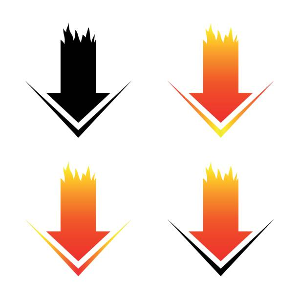

# HPE Model Downloader

[](FireDownload.jpg)

**Model Downloader** is a web UI + FastAPI service (Helm chart `model-downloader` v1.6.2, images `ghcr.io/ai-solution-eng/model-downloader` and `ghcr.io/ai-solution-eng/hf-downloader`) that submits HuggingFace model-download Jobs onto a Kubernetes cluster's shared model storage. Users pick a model and a target namespace in the browser; the service creates a per-submission HF-token Secret plus a downloader Job (PVC- or S3-backed) and tracks it to completion. Downloaded models are listed from the shared `models-pvc` and/or S3, and model configurations can be pushed from a curated catalog straight into the MLIS/AIOLI database. It is built for **HPE Private Cloud AI (PCAI / HPE Ezmeral Unified Analytics)**, where models land on the shared `models-pvc` every `project-user-*` namespace mounts, and/or an S3-compatible bucket such as MinIO.

## What problem(s) it solves

- **Pulling HF models into air-gapped / proxied PCAI clusters.** Downloader Jobs and the app pod get the HPE corporate proxy (`hpeproxy.its.hpecorp.net:8080`) and `no_proxy` environment via `hpe_proxies`, together with the httpx TLS-verification bypass needed to get through the Zscaler MITM proxy, which presents an untrusted certificate. Outbound GitHub fetches (catalog refresh) follow the same rule.
- **A shared `models-pvc` workflow without cluster access for end users.** End users never touch `kubectl`: they submit a download from the UI, the Job runs in their `project-user-*` namespace, writes the HF cache on the PVC every project namespace already mounts, and shows the resulting `pvc://models-pvc/large-models/<model>?containerPath=/mnt/models` URL in the Jobs table.
- **Model catalog management + push to MLIS.** A GPU-tier-grouped catalog (seeded from a bundled JSON, refreshable from GitHub, extendable in the UI or by pasting JSON) can push model configurations straight into the AIOLI/MLIS `packaged_models` table — the step that makes models appear in MLIS model serving.
- **Debug pods for cache inspection.** A one-click long-running debug shell mounts the same PVC at `/mnt`, so you can inspect/repair the model cache with `huggingface-cli` instead of submitting probe downloads. It is deliberately created as a Job so platform Kyverno admission admits it (see [Kyverno on hosted trial systems](#kyverno-on-hosted-trial-systems--read-before-deploying)).
- **S3 / MinIO downloads.** When the deployment has an S3-compatible backend, model files stream straight into `s3://<bucket>/<prefix>/<org>/<Model>/` with per-file parallelism — no PVC required — and the "Downloaded models" list scans both backends.

## Features

All of the following are implemented in `src/model_downloader/` and wired by `helm/`:

- **Web UI** (FastAPI + Jinja2 + static JS, dark/light theme): submit downloads, a live Jobs table with logs/progress/error columns and delete for finished jobs, a "Downloaded models" table, and a debug-pod section.
- **PVC downloads**: the Job runs `huggingface_hub.snapshot_download` with 8-way per-file parallelism (`max_workers=8`) into `HUGGINGFACE_HUB_CACHE` on the shared PVC mounted at `/mnt`. Default cache root is `/mnt/large-models/<model>`; an explicit custom absolute path is accepted and validated (no `..`). Retries (`downloader.backoffLimit`) resume the partial HF cache instead of restarting, because blobs and `.incomplete` files live on the PVC.
- **S3 downloads**: the Job lists repo files and uploads each one to S3 with a thread pool of 8 concurrent files; each upload itself uses S3 multipart (64 MB threshold, 8-way concurrency). Scratch space is an `emptyDir` sized by `downloader.s3WorkSize` (or `downloader.s3WorkPvcName` when set), so only in-flight files are held locally.
- **Queue with bounded concurrency**: at most `maxConcurrency` model downloads run at once; extra submissions queue in-process. On startup the queue reconciles previously created Jobs from Kubernetes, so downloads submitted before an app restart reappear in the UI.
- **Per-submission HF-token Secrets**: each submission creates `hf-token-<model>-<suffix>` in the target namespace, referenced only by that Job, and is deleted as soon as the Job finishes (or if Job creation is denied).
- **"Downloaded models" list**: merges three sources — succeeded job history, a live boto3 S3 listing, and a short-lived PVC scanner Job (`md-scan-*`, finds `models--<org>--<repo>` cache dirs) — deduplicated by model name, most recent first. The PVC is scanned on demand via **Rescan storage**, or automatically every `downloadList.pvcRefreshInterval` seconds when `downloadList.pvcScanEnabled: true`.
- **Namespace dropdown search** on the submit form, backed by `/api/namespaces` and filtered to `project-user-*` (an RBAC denial degrades to typing a namespace manually).
- **Debug pods**: UI-launched long-running shell Jobs (`md-debug-*`) mounting the same PVC at `/mnt` with `HUGGINGFACE_HUB_CACHE` preset; optional HF token; the UI prints the ready-made `kubectl exec` command and deleting a debug job from the UI also deletes its token Secret.
- **Model catalog** (`/catalog`): entries grouped by GPU tier — H200 (FP8 · 141 GB), RTX Pro 6000 (FP8/NVFP4 · 96 GB), L40S (FP8 · 48 GB). Seeded on start from the bundled `seed_catalog.json` without overwriting user edits or resurrecting removed entries; **Refresh from GitHub** pulls the upstream seed JSON from `catalog.githubUrl` (button hidden when unset); the direct-JSON box accepts a single object **or** an array for **Push to MLIS** or **Add to Catalog** (duplicates by `catalog_id` or `name`+`version` are skipped).
- **Chat templates**: pick a preset from the catalog or supply path + contents; the downloader Job writes the file into the model cache during the download.
- **ModelScan provenance gate**: every PVC download is scanned in-job for unsafe serialization formats before it can block (warn by default, `gate.mode: block` to fail the Job); the verdict rides `manifest.json` and the Downloaded-models/GC views.
- **PVC preflight + per-namespace quota**: submissions are checked for disk fit and namespace quota BEFORE a Job is created; refusals (422) name the exact bytes-needed vs bytes-free / used-vs-quota math in the submit error path.
- **TTL/GC eviction** (opt-in): a dry-run-first GC report in the UI (three-key AND deletion rule enforced in the GC CronJob — manifest AND no-AIOLI-row AND no-live-job, with fail-safe keeps when any cross-check is unavailable).
- **PCAI integration**: Istio VirtualService on `istio-system/ezaf-gateway` at `model-downloader.${DOMAIN_NAME}`, an oauth2-proxy `AuthorizationPolicy` in `istio-system`, a pre-install Kyverno ClusterPolicy stamping EZUA vendor labels (see below), and RBAC for cross-namespace Job/Secret creation, pod-log reads and namespace listing (plus read-only PVC `get`/`list` when preflight is on).

## Deploying on PCAI

PCAI users **never** run `helm install` or `kubectl apply`. The chart is imported into PCAI once (the packaged chart, e.g. `model-downloader-1.6.2.tar.gz`), and from then on deployments are just values: edit the chart's `values.yaml` in the PCAI **Helm Values** editor (or via the PCAI API) and apply. PCAI resolves `${DOMAIN_NAME}` itself before rendering, so leave those placeholders as-is.

**Before you start** (cluster-side prerequisites, not chart values):

- The target `project-user-*` namespaces have the shared `models-pvc` (PCAI provides this).
- For S3: the bucket exists (`s3.bucket` — the chart does not create it) and you have its access/secret keys.
- For MLIS push: the AIOLI database service is reachable and its password Secret (`aioli.dbPasswordSecret`, default `aioli-db-password` in namespace `mlis`) exists. The chart never creates it — if you don't have one yet:
  ```bash
  kubectl -n mlis create secret generic aioli-db-password \
    --from-literal=password='<aioli-db-password>'
  # aioli.dbPasswordSecret.name / .namespace / .key point at it (defaults shown).
  # Skip this entirely if you don't use the catalog's Push-to-MLIS feature.
  ```
- HF tokens need **no deploy-time setup**: every download submission creates its own short-lived `hf-token-<model>-<suffix>` Secret in the target namespace from the token typed in the UI, and deletes it when the Job finishes. The chart ships no token.
- For PCAI ingress: the platform gateway `istio-system/ezaf-gateway` and the `oauth2-proxy` auth provider exist.

**Required values** (the ones every deployment must set or confirm):

| Value | Why |
|---|---|
| `defaultNamespace` | Namespace pre-filled in the download form; must be a `project-user-*` namespace that owns a `models-pvc`. |
| `storage.backend` + `storage.default` | `pvc`, `s3`, or `both`; `default` is the preselected option in the submit form. With `backend: pvc` the app gets no S3 configuration at all. |
| `s3.endpointUrl`, `s3.bucket`, `s3.accessKeyId`, `s3.secretAccessKey` | Required when the backend includes `s3` (e.g. MinIO at `http://minio.minio.svc.cluster.local:9000`, bucket `mlis-models`). `s3.prefix` is optional. |
| `aioli.*` (`dbHost`, `dbPort`, `dbName`, `dbUser`, `dbPasswordSecret`) | MLIS/AIOLI database connection used by the catalog **Push to MLIS** endpoints (and the GC CronJob's read-only cross-check). Defaults: `aioli.dbPasswordSecret.name` = `aioli-db-password`, `aioli.dbPasswordSecret.namespace` = `mlis`, `aioli.dbPasswordSecret.key` = `password` — that Secret must exist with that key. |
| `ezua.virtualService.endpoint` | **REQUIRED when `ezua.enabled: true`** (the default — this is a PCAI app). The VirtualService template refuses to render without it: `Valid .Values.ezua.virtualService.endpoint is required !`. Set `model-downloader.${DOMAIN_NAME}` and leave the placeholder as-is — PCAI substitutes the real domain before rendering. Pair with `ezua.virtualService.istioGateway` (`istio-system/ezaf-gateway`): the VirtualService attaches to that gateway, so it must name an existing one. |
| Image tags | Packaged with the chart — `image.tag` v1.6.2 (matches the chart version), `downloader.image` `ghcr.io/ai-solution-eng/hf-downloader:v1.0`, `debugPod.image` / `downloadList.scanImage` `andrewbydlon/basic-ubuntu-essentials:v1.0`. Leave defaults unless you build your own images. |

**Optional values** (defaults are sane; see [helm/values.yaml](helm/values.yaml) comments):

- `maxConcurrency` — max parallel model downloads (default 4).
- `downloader.*` — Job resources (`downloader.resources`), `backoffLimit`, `nodeSelector`, `ttlSecondsAfterFinished`, `hf.*` timeouts (`downloadTimeout`, `etagTimeout`, `enableHfTransfer`, `disableXet`, `verifyTls`), `disableSecurityContext`/`downloader.securityContext` (`runAsUser`/`runAsGroup`, both `0` by default), S3 scratch (`s3WorkPvcName`, `s3WorkSize`, `s3WorkPath`).
- `downloadList.*` — `enabled`, `pvcScanEnabled`, `pvcRefreshInterval`, `scanImage`.
- `provenance.*` — `enabled` (default true) and `revision` (default `"main"`). After a successful PVC download the Job writes `${cache_root}/models--<org>--<Repo>/manifest.json`: repo, the resolved revision commit, per-file sha256 + size (LFS files cross-checked against Hub metadata when reachable — non-LFS files carry the local hash only), license, download time, job id, namespace, and a free-text `submitted_by` (empty today; identity arrives later). The scanner's model list carries a `provenance_manifest` flag per model. `enabled: false` omits the whole step and downloads on the default branch exactly as before.
- `gate.*` — the ModelScan provenance gate. `enabled` (default true) runs [modelscan](https://pypi.org/project/modelscan/) inside the downloader Job on the unsafe serialization formats (`.bin`/`.pt`/`.pth`/`.ckpt` + pickle-class files) after the manifest hashing; safetensors-only snapshots are skipped. The verdict lands in `manifest.json`'s `scan` block (`verdict`/`mode`/`threshold`/`detail`) and the PVC scanner surfaces it as a per-model `scanned` column. `mode: warn` (default) records and proceeds; `mode: block` makes the Job exit 1 on an unsafe verdict so the failure appears verbatim in the Jobs table's Error column — a broken scanner is always warn-only. `threshold` (default `low`) downgrades findings at or below it to clean. **Rebuilding the downloader image is required** (the Dockerfile gains the `modelscan` dependency); the gate degrades to `error`-verdict records on images without modelscan.
- `preflight.*` + `quota.*` — PVC preflight + per-namespace quota. Before a downloader Job is created the app checks (a) disk fit — model size from the Hub API vs PVC `status.capacity` minus used bytes (a `du -sb` pass in the scanner Job; both TTL-cached, with in-flight submissions charged between scans) and (b) the namespace's byte quota (`quota.namespaces.<ns>` map + `quota.default`; values accept `500Gi`-style quantities). `mode: refuse` (default) returns a 422 naming bytes-needed vs bytes-free / used vs quota; `warn` reports without refusing; `off` skips the check. `preflight.enabled: false` also drops the read-only `persistentvolumeclaims` get/list RBAC addition. Refusals and warnings surface in the UI's submit error path verbatim. Tuning: `preflight.safetyMargin` (default `0`, k8s quantity or bytes) is headroom subtracted from free space before the fit check, covering writes the `du` snapshot can't see yet; `preflight.usageTtl` (default `120`s) caches the used-bytes census; `preflight.sizeTtl` (default `300`s) caches Hub size estimates. (Env vars are injected only when a value differs from its default — the defaults are compiled into the app.)
- `gc.*` — TTL/GC eviction (default **off**). `enabled: true` renders a CronJob (`schedule` default nightly `0 3 * * *`, pod template = the scanner Job's admission pattern verbatim) plus the UI's **Storage GC (dry-run report)** section. Deletion rule — three-key AND, all three must hold: `manifest.json` present next to the models--* dir, **no** AIOLI `packaged_models` row referencing the model (matched by cache-dir name / repo id appearing in the uri — never exact path equality; custom cache roots), and **no** live managed job pinning the cache root. Each signal alone is unreliable (job TTLs erase evidence; paths vary; MLIS rows go stale) — hence the AND. `dryRun: true` is the default: the job logs every verdict and deletes nothing; the `/api/gc/report` view (cached, `?force=1` rebuilds) is the review surface. `ttlDays` (default 30) is the age line, `minKeep` an LRU floor, `protectedModels` a glob list never to delete, and an unreachable AIOLI/jobs API fail-safes to *keep everything*. The GC job's AIOLI access is a strictly read-only `SELECT` (`default_transaction_read_only=on`); S3 eviction is out of scope. `gc.concurrencyPolicy` (default `Forbid`) keeps two GC pods from ever running at once — leave it alone unless you have a reason.
- `debugPod.*` — `enabled`, `image` (`repository`, `tag`, `pullPolicy`), `pvcName` (override), `disableSecurityContext`/`securityContext`, `user`, `cachePath`, `ttlSecondsAfterFinished`.
- `hpe_proxies` + `pcai.httpsProxy` / `pcai.noProxy` — proxy env on downloader Jobs and the app pod, plus the Zscaler TLS bypass. `true` only behind the HPE corporate proxy. `pcai.enabled` is usually left unset: it then falls back to the `hpe_proxies` flag; set it explicitly only to force proxy env on/off independently of `hpe_proxies`.
- `catalog.*` — `enabled`, `size`, `storageClassName`, `githubUrl` (enables **Refresh from GitHub**), `githubVerifyTls`.
- `kyverno.enabled` — keep `true` on any PCAI cluster (see next section).
- `ezua.*` — `domainName`, `virtualService.endpoint` / `.istioGateway` / `.timeout`, `authorizationPolicy.namespace` / `.providerName`.
- Rarely needed: `service.*`, `nameOverride`/`fullnameOverride`.

## Chart values reference

Every key in [helm/values.yaml](helm/values.yaml), with the default from the chart and what actually consumes it. The per-feature walkthrough above ([Required values](#deploying-on-pcai), [Optional values](#deploying-on-pcai)) covers the behavioral keys in prose; this section is the flat lookup table, ending with the standard Kubernetes knobs.

| Key | Default | Effect |
|---|---|---|
| `maxConcurrency` | `4` | Max model downloads running at once; extras queue in-process. |
| `defaultNamespace` | `project-user-<your-username>` (override it) | Namespace pre-filled in the submit form — set it to a `project-user-*` namespace that owns `models-pvc`. |
| `service.type` / `service.port` | `ClusterIP` / `8000` | Cluster-internal exposure of the UI; the Istio VirtualService routes to this port. |
| `hpe_proxies` | `false` | Master proxy flag: proxy/no_proxy env on downloader Jobs, debug pods and the app pod + the httpx TLS-verification bypass for the Zscaler MITM. Does NOT control `kyverno`/`ezua`. |
| `pcai.httpsProxy` / `pcai.noProxy` | `http://hpeproxy.its.hpecorp.net:8080` / long cluster-local list | Proxy endpoints used only when proxying is on. `pcai.enabled` (unset by default) forces them on/off independently of `hpe_proxies`. |
| `storage.backend` / `storage.default` | `both` / `pvc` | Which backends users can pick; which is preselected. `backend: pvc` removes all S3 env from the app. |
| `s3.*` | MinIO defaults, demo credentials | `endpointUrl`, `bucket` (must exist), `prefix` (objects land at `s3://<bucket>/<prefix>/<org>/<Model>/`), `accessKeyId`, `secretAccessKey` — injected only when the backend includes `s3`. |
| `downloadList.enabled` | `true` | Master switch for the Downloaded-models list. |
| `downloadList.pvcScanEnabled` | `false` | Auto-rescan the PVC every interval; off = scan on **Rescan storage** clicks only. |
| `downloadList.pvcRefreshInterval` | `60` (s) | PVC scan cache TTL; S3 and job history are always fresh. |
| `downloadList.scanImage` | `andrewbydlon/basic-ubuntu-essentials:v1.0` | Image for the short-lived PVC scanner Job (needs `/bin/sh`, `find`, `stat`) and, when `gc.enabled`, the GC CronJob pod too. |
| `provenance.enabled` | `true` | Writes `manifest.json` (repo, resolved revision, per-file sha256+size, license, job/namespace) next to each cache dir. `false` omits the step entirely. |
| `provenance.revision` | `"main"` | Revision the download pins to — a tag or commit sha gives reproducible re-downloads. |
| `gate.enabled` / `gate.mode` / `gate.threshold` | `true` / `warn` / `low` | ModelScan gate on unsafe formats; `block` fails the Job on an unsafe verdict; `threshold` downgrades severities at or below it to clean. Needs the rebuilt downloader image. |
| `preflight.enabled` / `preflight.mode` | `true` / `refuse` | Submit-time disk-fit gate; `false` also drops the PVC get/list RBAC. `warn`/`off` as described above. |
| `preflight.safetyMargin` | `0` | Headroom (bytes or k8s quantity) subtracted from free space before the fit check — covers writes the `du` snapshot can't see yet. |
| `preflight.usageTtl` | `120` (s) | TTL of the cached storage census (used bytes / usage split). |
| `preflight.sizeTtl` | `300` (s) | TTL of cached Hub model-size estimates. |
| `quota.default` / `quota.namespaces` / `quota.mode` | `""` / `{}` / `refuse` | Per-namespace byte quotas (k8s quantities or plain bytes), independent of `preflight.mode`. |
| `gc.enabled` | `false` | Renders the GC CronJob + the UI dry-run report; off = nothing GC-related rendered and `/api/gc/*` return 400. |
| `gc.schedule` | `"0 3 * * *"` | Standard cron for the CronJob. |
| `gc.ttlDays` | `30` | Delete cache dirs whose newest mtime is older than this (0 disables the TTL line). |
| `gc.dryRun` | `true` | Log every verdict, delete nothing. Flip only after reviewing the report. |
| `gc.minKeep` | `0` | LRU floor — never delete below this many cache dirs (0 = no floor). |
| `gc.protectedModels` | `[]` | Glob list of model ids / cache-dir names never to delete. |
| `gc.concurrencyPolicy` | `Forbid` | Keeps two GC pods from ever running at once. |
| `gc.resources` | `100m`/`128Mi` req, `500m`/`256Mi` lim | Resources of the GC CronJob pod. |
| `downloader.image.repository` / `downloader.image.tag` | `ghcr.io/ai-solution-eng/hf-downloader` / `v1.0` | The downloader Job's image (both PVC and S3 paths). |
| `downloader.pvcName` | `models-pvc` | PVC mounted at `/mnt` for the model cache (pvc backend) — also what the GC CronJob mounts. |
| `downloader.nodeSelector` | `{}` | Node selector for downloader Jobs (empty = scheduler chooses). Debug pods follow it too — there is no separate `debugPod.nodeSelector`. |
| `downloader.s3WorkPvcName` / `downloader.s3WorkSize` / `downloader.s3WorkPath` | `""` / `20Gi` / `/mnt/s3work` | S3-backend scratch: an existing PVC, else an `emptyDir` sized by `s3WorkSize`; cache root under the `/mnt` mount. |
| `downloader.backoffLimit` | `2` | Retries before the Job is Failed; retries resume the partial HF cache on the PVC. `0` disables. |
| `downloader.disableSecurityContext` | `true` | Sets the `hpe-ezua/disable-sc` pod annotation so the Job can run as root and mount the shared PVC (PCAI only). |
| `downloader.ttlSecondsAfterFinished` | `3600` | Finished downloader Jobs self-delete after this. |
| `downloader.user` | `<your-username>` (override it) | `USER` env var in the Job — HF request headers / logging. Set it to your own username. |
| `downloader.hf.downloadTimeout` / `.etagTimeout` | `"300"` / `"30"` | `HF_HUB_DOWNLOAD_TIMEOUT` / `HF_HUB_ETAG_TIMEOUT`. |
| `downloader.hf.enableHfTransfer` / `.disableXet` | `"0"` / `"1"` | `HF_HUB_ENABLE_HF_TRANSFER` / `HF_HUB_DISABLE_XET`. |
| `downloader.hf.verifyTls` | unset → follows `hpe_proxies` | Explicit TLS-verify override for the downloader (true = verify). |
| `debugPod.enabled` | `true` | Enables the UI's Launch-debug-pod section. |
| `debugPod.pvcName` | `""` → `downloader.pvcName` | Mount a different PVC than the downloader's. |
| `debugPod.disableSecurityContext` | `true` | Same `hpe-ezua/disable-sc` opt-out as the downloader Jobs. |
| `debugPod.user` / `debugPod.cachePath` | matches `downloader.user` (override it) / `/mnt/large-models` | `USER` and `HUGGINGFACE_HUB_CACHE` inside the debug shell. |
| `debugPod.ttlSecondsAfterFinished` | `86400` | Applies only once the debug Job finishes/fails (it normally runs `tail -f /dev/null`); a dead debug job self-cleans. |
| `catalog.enabled` | `true` | Renders the catalog PVC and mounts it at `/mnt/catalog`. |
| `catalog.size` / `catalog.storageClassName` | `100Mi` / `""` (default class) | Catalog PVC capacity / storage class. |
| `catalog.githubUrl` | tools-repo seed JSON | Enables **Refresh from GitHub** (button hidden when empty). |
| `catalog.githubVerifyTls` | unset → follows the downloader's TLS rule | Override for that fetch (true = verify). |
| `aioli.dbHost` / `.dbPort` / `.dbName` / `.dbUser` | MLIS service defaults | AIOLI/MLIS database connection for Push to MLIS and the GC cross-check. |
| `aioli.dbPasswordSecret.name` / `.namespace` / `.key` | `aioli-db-password` / `mlis` / `password` | Where the database password Secret lives and which key holds it. |
| `kyverno.enabled` | `true` | Pre-install ClusterPolicy stamping `hpe-ezua` vendor labels on the app Deployment/Service (EZUA discovery). |
| `ezua.enabled` | `true` | Renders the Istio VirtualService + AuthorizationPolicy. `false` (non-PCAI clusters) removes the ingress entirely — and with it the `ezua.virtualService.endpoint` requirement. |
| `ezua.domainName` | `${DOMAIN_NAME}` | Informational only — no template reads it; PCAI substitutes the placeholder everywhere. |
| `ezua.virtualService.endpoint` | `model-downloader.${DOMAIN_NAME}` | **REQUIRED when `ezua.enabled: true`** — the VirtualService host; render fails without it. |
| `ezua.virtualService.istioGateway` / `.timeout` | `istio-system/ezaf-gateway` / `300s` | Gateway the VirtualService attaches to / route timeout. |
| `ezua.authorizationPolicy.namespace` / `.providerName` | `istio-system` / `oauth2-proxy` | Where the `CUSTOM` AuthorizationPolicy lives and which auth provider it references. |

### Standard Kubernetes knobs

Pure boilerplate — plain pass-through into the pod templates, same meaning as in any chart. Defaults are sized for the workload; touch them only when a pod is being OOM-killed, throttled, or you have cluster quota pressure. Paths:

| Key | Default | Consumed by |
|---|---|---|
| `resources.requests.cpu` / `.requests.memory` | `200m` / `256Mi` | App Deployment (via `resources`). |
| `resources.limits.cpu` / `.limits.memory` | `1` / `512Mi` | App Deployment. |
| `downloader.resources.requests.cpu` / `.requests.memory` | `2` / `4Gi` | Downloader Job pods (PVC and S3 templates). |
| `downloader.resources.limits.cpu` / `.limits.memory` | `4` / `8Gi` | Downloader Job pods. |
| `gc.resources.requests.cpu` / `.requests.memory` | `100m` / `128Mi` | GC CronJob pod. |
| `gc.resources.limits.cpu` / `.limits.memory` | `500m` / `256Mi` | GC CronJob pod. |
| `downloader.securityContext.runAsUser` / `.runAsGroup` | `0` / `0` | Downloader containers (root, so the shared model PVC is traversable). |
| `debugPod.securityContext.runAsUser` / `.runAsGroup` | `0` / `0` | Debug container (same reason). |
| `debugPod.image.repository` / `debugPod.image.tag` | `andrewbydlon/basic-ubuntu-essentials` / `v1.0` | Debug shell image: injected into the app pod as `DEBUG_POD_IMAGE`, which the app substitutes into the debug Job's `__IMAGE__` placeholder. |
| `debugPod.image.pullPolicy` | `IfNotPresent` | Debug container image-pull policy (`imagePullPolicy` on the debug Job — contrast the app's deliberate `Always`). |
| `image.pullPolicy` | `Always` | App container. `Always` is deliberate: overwriting the tag in the registry is enough to deploy a rebuild — `IfNotPresent` would keep a node-cached image. |

Every `resources` key accepts standard Kubernetes quantities (`250m`, `1`, `512Mi`, `8Gi`); every `runAs*` key is the numeric UID/GID. The scanner Job's resources and securityContext are hardcoded in the template (not values-driven); image tags (`image.tag`, `downloader.image.tag`) are packaged with the chart — change them only for your own builds.

## Kyverno on hosted trial systems — read before deploying

This is the section that decides whether downloads run at all on a hosted trial. Everything below is taken from this repository's own code and comments.

### What the platform policy does

HPE PCAI ships a **cluster-wide Kyverno policy named `protect-models-pvc`** that **denies any pod mounting the shared `models-pvc` unless it carries the MLIS authorization label `hpe-ezua/app: mlis`**. A pod created directly — by a user or by this app's ServiceAccount — is not allowed to set that label, so creation is rejected. The repo documents the denial rule and message verbatim:

> denied by the platformwide protect-models-pvc Kyverno policy
> (prevent-unauthorized-create-with-mlis: "Insufficient authorization to set
> the 'hpe-ezua/app' label to 'mlis'")

— `helm/templates/configmap-job-template.yaml` (comment above the `debug-job.yaml` template, lines 653–660; same wording in the `debugPod:` block of `helm/values.yaml`, lines 289–294, and in `src/model_downloader/app/k8s.py`, `create_debug_job`'s docstring).

### How this chart's Jobs get admitted

- **Downloader Jobs carry the label.** Both Job templates (`job.yaml` for PVC, `job-s3.yaml` for S3) set `hpe-ezua/app: mlis` on the pod template (`helm/templates/configmap-job-template.yaml` lines 34 and 499), alongside the `hpe-ezua/disable-sc` security-context opt-out annotation that lets them run as root and mount the root-owned shared PVC.
- **The UI debug pod is a Job on purpose.** A bare Pod created by the app's ServiceAccount would be denied by `protect-models-pvc` for setting `hpe-ezua/app: mlis`. The debug pod is therefore created as a Job (`debug-job.yaml`, label at line 687): its Pod is then created by the **kube-system job-controller**, i.e. the exact same admission path as the downloader Jobs, and pods with these labels are admitted (`helm/values.yaml` lines 289–294, `src/model_downloader/app/k8s.py` `create_debug_job` docstring at lines 254–262, UI text in `src/model_downloader/app/templates/index.html` lines 186–190).
- **The PVC scanner Job carries the same label** (`scan-job.yaml`, line 762), so "Rescan storage" works under the same policy.
- **The GC CronJob pod carries the same label** (`helm/templates/gc-cronjob.yaml`, line 51; the pod template copies the scanner Job's admission pattern verbatim), so an enabled GC works under the same policy on hosted trials too.

### The chart's own Kyverno policy

Separate from the platform policy, the chart installs a **pre-install ClusterPolicy named `add-vendor-app-labels-<release>-<chart>`** (`helm/templates/kyverno-policy.yaml`, rule `add-vendor-app-labels`), gated by `kyverno.enabled` (default `true`). It stamps `hpe-ezua/type: app-service-core` and `hpe-ezua/app: model-downloader` onto Deployments and Services **in the release namespace** so EZUA/PCAI ingress discovery picks the app up. It does not touch the downloader Jobs (those live in `project-user-*` namespaces and rely on the platform policy described above).

### What must hold on a hosted trial

On **SE G2** this all works out of the box. On a **hosted trial** the *customer's* platform policies are the gate, and the following must hold before downloads will run:

1. **The platform `protect-models-pvc` policy admits the labeled Jobs.** The chart's Jobs run in `project-user-*` namespaces and present `hpe-ezua/app: mlis` — the exact label the policy wants. If the customer's installed policy is stricter than the stock one (e.g. it also restricts *who* may set the label, or it does not exempt job-controller-created pods), the customer admin must apply the platform policy patch/exception for the namespaces this release writes to. Confirm with the customer's PCAI admin before assuming a denial is an app bug. The concrete patch is in [the next subsection](#the-platform-policy-patch-customer-admin).
2. **`kyverno.enabled` stays `true`.** Disabling it stops the pre-install `add-vendor-app-labels-<release>-<chart>` ClusterPolicy from stamping the vendor labels, and the Deployment/Service can disappear from EZUA's app discovery.
3. **`debugPod.enabled` / downloader behavior is unchanged** — the debug pod's Job-based admission path is the documented workaround; do not "fix" a denial by switching it to a bare Pod, that will always be denied.

### The platform-policy patch (customer admin)

The concrete patch for the hosted-trial case where the installed `protect-models-pvc` policy denies job-controller-created pods: it appends a `NotEquals` condition to the deny conditions of `rules[1]`, exempting the kube-system job-controller — which creates the Pods for every Job this chart submits (downloader, debug, and scanner alike) — while leaving the original conditions in force for every other creator:

```bash
kubectl patch clusterpolicy protect-models-pvc --type json -p='[
  {"op": "add", "path": "/spec/rules/1/validate/deny/conditions/all/-",
   "value": {"key": "{{request.userInfo.username}}", "operator": "NotEquals", "value": "system:serviceaccount:kube-system:job-controller"}}
]'
```

After applying, Job pods created by the job-controller are no longer denied and the Jobs can mount `models-pvc`; the admission webhook may take a few seconds to pick up the updated policy. This mutates a customer-owned, cluster-wide platform policy — apply it only with the customer's PCAI admin, and only if their installed policy does not already carry the exception.

### What a denial looks like

Admission failures surface as Kubernetes API errors, passed through verbatim:

- **Debug pod launch**: the API handler maps the `ApiException` to `k8s API returned <status>: <apiserver message>` (`src/model_downloader/app/main.py` `_api_error_detail`, lines 687–706) and the UI shows it in the message box. For this policy you would see, e.g., `k8s API returned 400: ... prevent-unauthorized-create-with-mlis: Insufficient authorization to set the 'hpe-ezua/app' label to 'mlis'`. On failure the app cleans up the token Secret it had created (`src/model_downloader/app/k8s.py`, the `except ApiException` block of `create_debug_job`, lines 292–298).
- **Download submission**: the queue records the raw exception (including the apiserver denial body) in the job's **Error** column of the Jobs table (`src/model_downloader/app/queue.py` `_run`, lines 207–209).
- An RBAC denial (403) surfaces the same way, e.g. on `/api/namespaces`.

If you see either message on a hosted trial, it is the customer's platform policy — take it to the admin with the rule names above, not to the chart.

## Deployment targets

### SE G2

The internal HPE "G2" PCAI cluster (`pcai-se-ai-application.hst.rdlabs.hpecorp.net`):

- `hpe_proxies: true` — downloader Jobs and the app pod go through `hpeproxy.its.hpecorp.net:8080` with the internal `no_proxy` list; TLS verification is bypassed because the Zscaler MITM cert is untrusted (also applies to the catalog's GitHub fetch).
- Storage: both backends — the shared `models-pvc` (default) and MinIO at `http://minio.minio.svc.cluster.local:9000`, bucket `mlis-models`, prefix `large-models`.
- `defaultNamespace: project-user-<USERNAME>`; Kyverno works out of the box.
- Sanitized example: [helm/values-examples/values.g2.yaml](helm/values-examples/values.g2.yaml).

### Hosted trial

A customer-hosted PCAI system:

- Everything ingress-related uses `${DOMAIN_NAME}` placeholders (`ezua.domainName`, `ezua.virtualService.endpoint` = `model-downloader.${DOMAIN_NAME}`) — PCAI substitutes the real domain before rendering. The UI is then served at `https://model-downloader.<customer-domain>` behind oauth2-proxy SSO.
- `hpe_proxies: false` unless the cluster egresses via the HPE corporate proxy.
- The Kyverno requirements in [the section above](#kyverno-on-hosted-trial-systems--read-before-deploying) are the main risk: the customer's platform `protect-models-pvc` policy must admit the labeled downloader/debug/scanner Jobs (and the GC CronJob pod, when `gc.enabled: true` — same job-controller admission path, same labels), and `kyverno.enabled` must stay `true`.
- Sanitized example: [helm/values-examples/values.hosted-trial.yaml](helm/values-examples/values.hosted-trial.yaml).

## Using the UI

- **Submit a download** (`/`): pick a namespace via the searchable dropdown (filtered to `project-user-*`), enter a model name (`org/Repo-Name`), your HF token (stored as a per-submission Secret, deleted when the job finishes), optionally a custom download location (blank = `/mnt/large-models/<model>`), a chat-template preset or custom path/contents, and — when the deployment has both backends — choose **Model PVC** or **S3 path** (pre-filled `s3://<bucket>/<prefix>/`). Up to `maxConcurrency` models download in parallel; the rest queue. A submission refused by preflight/quota shows `Submission refused: ...` with the exact bytes math (422) in the message box; warn-mode decisions appear as a `— warning: ...` suffix on the success message.
- **Jobs table**: status, output URL (`pvc://models-pvc/...?containerPath=/mnt/models` or `s3://bucket/prefix/org/Model/`), submitted/finished timestamps, live logs and progress (parsed from pod logs), and delete for finished jobs. A gate-mode-block scan failure surfaces here verbatim in the Error column.
- **Downloaded models**: one row per model found on any backend (job history + S3 listing + PVC scanner), most recent first, with the overall on-disk size of the checkpoint (from the PVC scanner's `du -sb`; `—` when unknown, e.g. job-history/S3-only rows); **Rescan storage** forces a fresh scan; the status line states which automatic scans are enabled.
- **Storage GC (dry-run report)** (when `gc.enabled: true`): one row per model cache dir on the PVC scan root with size, age, manifest presence, ModelScan verdict, and the three-key verdict (`delete`/`keep` + reason). Read-only — the actual deletion runs in the GC CronJob and stays off until `gc.dryRun` is flipped. **Rebuild GC report** forces a fresh evaluation (scan Job + read-only AIOLI SELECT + live-job cross-check).
- **Debug pod**: launch a long-running shell in any `project-user-*` namespace that mounts the model PVC at `/mnt` (optionally with an HF token for `hf download` inside it), then connect with the displayed `kubectl exec -it $(kubectl get pods -n <ns> -l job-name=<job> -o jsonpath='{.items[0].metadata.name}') -- bash`. Delete it from the table when done — that removes its token Secret too.
- **Model catalog** (`/catalog`): browse entries by GPU tier, view full model configurations, add/edit/delete via the form, **Refresh from GitHub**, paste JSON (object or array) to **Push to MLIS** directly or **Add to Catalog**, and select entries to **Push Selected to MLIS** (duplicates by `name`+`version` are skipped per push).

## Documentation index

| Document | Contents |
|---|---|
| [helm/values.yaml](helm/values.yaml) | Canonical, fully commented default for every chart value. |
| [helm/values-examples/README.md](helm/values-examples/README.md) | How the example values files are meant to be used on PCAI; secrets hygiene. |
| [helm/values-examples/values.g2.yaml](helm/values-examples/values.g2.yaml) | Sanitized **SE G2** site values — full paste-ready document. |
| [helm/values-examples/values.hosted-trial.yaml](helm/values-examples/values.hosted-trial.yaml) | Sanitized **hosted-trial** site values — full paste-ready document. |

Per-site values with real credentials live in `helm/local/` (repo-only: gitignored, hardlink-ignored, never packaged — see `helm/local/README.md` in the source repo). The files under `helm/values-examples/` are the shareable counterparts of those.
